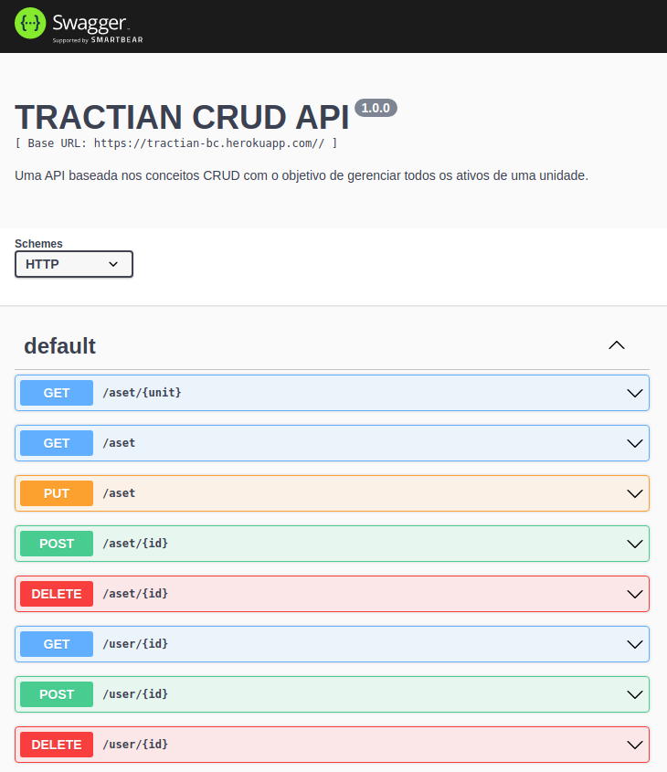

# TRACTIAN CRUD API

## Descrição :memo:

Esta API tem como objetivo gerenciar usuários, unidades e ativos de uma empresa.

Com a função de ler, criar, editar e excluir cada uma dessas instâncias, conseguimos fazer toda essa movimentação armazenando as informações em um banco de dados.

---

## Documentação :books:



Para documentar todas as funções da API, foi utilizado o Swagger. 

Caso queira consultar a documentação, ela está disponível neste [link](https://tractian-bc.herokuapp.com/doc/).

---

## Tecnologias :wrench:

- NodeJs;
- Express;
- TypeScript;
- Mongoose;
- MongoDB;
- Swagger;
- ESLint;
- Mocha, Chai e Sinon;
- Heroku;
- CI;
- Zod;
- MongoDB Atlas.

---

## Instalando a aplicação :file_cabinet:

Para clonar o repositório para a sua máquina e instalar as dependências, basta rodar o comando: 

- *Para chave SSH* 

```
git clone git@github.com:andremoraes98/tractian-bc.git && cd tractian-bc && npm install
```

Depois das dependências instaladas, basta rodar o comando:

```
npm start
```

Feito isso, a aplicação estará rodando localmente. Se não configurada uma porta específica em uma variável de ambiente, ela roda, por padrão, na porta 3001.

Depois que ela estiver rodando, basta seguir a [documentação](https://tractian-bc.herokuapp.com/doc/) e testar.

## Implementação futura :soon:

- Autenticação do usuário com credenciais (login e senha), utilizando o JSON Web Token;

--- 

Feito com muito empenho, dedicação e esforço por [eu mesmo](https://www.linkedin.com/in/moraesandre/).